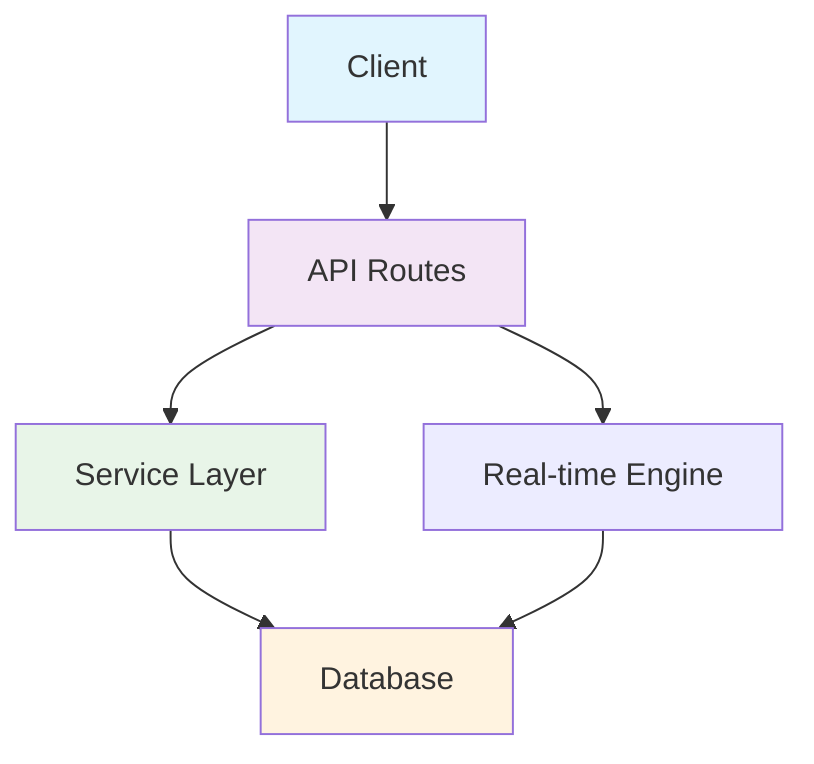

# Code Documentation Standards

## 📚 Overview

This document establishes comprehensive code documentation standards for the GHXSTSHIP codebase, ensuring maintainability, readability, and enterprise-grade code quality.

## 🎯 Documentation Principles

### Core Principles
- **Clarity First**: Documentation should be clear and unambiguous
- **Maintenance**: Keep documentation current with code changes
- **Accessibility**: Write for future maintainers, not just current team
- **Consistency**: Follow established patterns and conventions

### Documentation Hierarchy
1. **README Files**: Project/module overview and setup
2. **Inline Comments**: Explain complex logic and business rules
3. **JSDoc/TypeDoc**: API documentation for public interfaces
4. **Architecture Docs**: System design and decisions
5. **Change Logs**: Track significant modifications

## 📝 Code Comment Standards

### Comment Types

#### 1. Function Documentation
```typescript
/**
 * Calculates the total budget utilization for a project
 * @param projectId - Unique identifier of the project
 * @param includePending - Whether to include pending expenses in calculation
 * @returns Promise resolving to utilization percentage (0-100)
 * @throws {ProjectNotFoundError} When project doesn't exist
 * @throws {DatabaseError} When database operation fails
 * @example
 * ```typescript
 * const utilization = await calculateBudgetUtilization('proj-123', true);
 * console.log(`Budget is ${utilization}% utilized`);
 * ```
 */
async function calculateBudgetUtilization(
  projectId: string,
  includePending: boolean = false
): Promise<number> {
  // Implementation...
}
```

#### 2. Class Documentation
```typescript
/**
 * Service class for managing project budgets and financial tracking
 *
 * Handles budget creation, expense tracking, and utilization calculations
 * with real-time updates and audit logging.
 *
 * @example
 * ```typescript
 * const budgetService = new BudgetService(db);
 * const budget = await budgetService.createBudget(budgetData);
 * ```
 */
export class BudgetService {
  // Implementation...
}
```

#### 3. Complex Logic Comments
```typescript
// Calculate budget utilization with proper rounding
// Business rule: Round to 2 decimal places for financial accuracy
// Formula: (spent / total) * 100, handling division by zero
const utilization = total > 0
  ? Math.round((spent / total) * 100 * 100) / 100  // Round to 2 decimals
  : 0; // Avoid division by zero for new budgets
```

#### 4. TODO and FIXME Comments
```typescript
// TODO: Implement budget approval workflow (Priority: High)
// FIXME: Race condition in concurrent budget updates (Ticket: PROJ-456)
// HACK: Temporary workaround for Supabase RLS limitation
```

### Comment Guidelines

#### When to Comment
- ✅ Complex business logic
- ✅ Non-obvious algorithms
- ✅ API integration points
- ✅ Security-related code
- ✅ Performance optimizations
- ✅ Workarounds and hacks

#### When NOT to Comment
- ❌ Obvious code (`i++ // increment i`)
- ❌ Temporary debug code
- ❌ Commented-out code (delete instead)
- ❌ Author information (use git blame)

## 📖 README Standards

### Project README Structure
```markdown
# Project Name

## Overview
[Brief description of purpose and scope]

## Installation
[Setup and installation instructions]

## Usage
[Basic usage examples]

## API Reference
[Key functions/classes with examples]

## Configuration
[Configuration options and environment variables]

## Testing
[How to run tests]

## Deployment
[Deployment procedures]

## Contributing
[Contribution guidelines]

## License
[License information]
```

### Module README Structure
```markdown
# Module Name

## Purpose
[What this module does]

## Key Components
- Component1: [description]
- Component2: [description]

## Dependencies
[List of dependencies and why they're needed]

## Usage Examples
[Code examples]

## Testing
[Testing approach and coverage]

## Architecture Notes
[Important design decisions]
```

## 🔧 JSDoc Standards

### Function Documentation
```typescript
/**
 * Retrieves a project by ID with related data
 *
 * @param id - The unique project identifier
 * @param options - Query options for related data
 * @param options.includeMembers - Include project members in response
 * @param options.includeBudget - Include budget information
 * @returns Promise resolving to project data or null if not found
 *
 * @example
 * ```typescript
 * // Get basic project info
 * const project = await getProject('123');
 *
 * // Get project with related data
 * const fullProject = await getProject('123', {
 *   includeMembers: true,
 *   includeBudget: true
 * });
 * ```
 */
export async function getProject(
  id: string,
  options: {
    includeMembers?: boolean;
    includeBudget?: boolean;
  } = {}
): Promise<Project | null> {
  // Implementation...
}
```

### Type Documentation
```typescript
/**
 * Represents a project in the system
 */
export interface Project {
  /** Unique identifier for the project */
  id: string;

  /** Project name (3-100 characters) */
  name: string;

  /** Detailed project description */
  description?: string;

  /** Current project status */
  status: ProjectStatus;

  /** Project budget information */
  budget?: Budget;

  /** Project members and their roles */
  members: ProjectMember[];

  /** Creation timestamp */
  createdAt: Date;

  /** Last modification timestamp */
  updatedAt: Date;
}
```

## 🏗️ Architecture Documentation

### System Architecture Diagrams


### Data Flow Documentation
```typescript
// Data flow: User Creation
// 1. Client validates input using Zod schema
// 2. API route authenticates request and checks permissions
// 3. Service layer handles business logic and validation
// 4. Database transaction creates user and audit log
// 5. Real-time notification sent to admin users
// 6. Email confirmation sent to new user
```

## 🧪 Testing Documentation

### Test File Organization
```
src/
  components/
    Button/
      Button.tsx
      Button.test.tsx      # Unit tests
      Button.stories.tsx   # Storybook stories
  services/
    UserService.ts
    UserService.test.ts   # Unit tests
    __mocks__/           # Mock implementations
```

### Test Documentation Standards
```typescript
describe('UserService', () => {
  describe('createUser', () => {
    it('should create a user with valid data', async () => {
      // Given: Valid user data
      const userData = {
        email: 'user@example.com',
        name: 'John Doe'
      };

      // When: User is created
      const result = await userService.createUser(userData);

      // Then: User should be created successfully
      expect(result.success).toBe(true);
      expect(result.data.email).toBe(userData.email);
    });

    it('should reject invalid email addresses', async () => {
      // Given: Invalid email
      const invalidData = {
        email: 'invalid-email',
        name: 'John Doe'
      };

      // When: User creation is attempted
      const result = await userService.createUser(invalidData);

      // Then: Creation should fail with validation error
      expect(result.success).toBe(false);
      expect(result.error.message).toContain('Invalid email');
    });
  });
});
```

## 🔄 Change Documentation

### Change Log Format
```markdown
# Changelog

All notable changes to this project will be documented in this file.

The format is based on [Keep a Changelog](https://keepachangelog.com/en/1.0.0/),
and this project adheres to [Semantic Versioning](https://semver.org/spec/v1.0.0.html).

## [Unreleased]

### Added
- New feature description

### Changed
- Modified feature description

### Deprecated
- Deprecated feature description

### Removed
- Removed feature description

### Fixed
- Bug fix description

### Security
- Security improvement description

## [1.0.0] - 2025-09-28

### Added
- Initial release with core functionality
```

### Commit Message Standards
```
type(scope): description

Types:
- feat: New feature
- fix: Bug fix
- docs: Documentation changes
- style: Code style changes
- refactor: Code refactoring
- test: Testing changes
- chore: Maintenance tasks

Examples:
- feat(auth): Add OAuth2 login support
- fix(api): Handle null response in user service
- docs(readme): Update installation instructions
```

## 🛠️ Development Workflow

### Pre-commit Hooks
```bash
#!/bin/bash
# Pre-commit hook to validate documentation

# Check for TODO comments in committed code
if git diff --cached | grep -q "TODO\|FIXME"; then
  echo "⚠️  Found TODO/FIXME comments in committed code"
  echo "Please resolve or document these items"
  exit 1
fi

# Validate JSDoc comments
npm run docs:validate
```

### Documentation Review Process
1. **Code Review**: Include documentation in PR review
2. **Automated Checks**: ESLint rules for documentation standards
3. **Documentation Review**: Dedicated review for significant changes
4. **User Testing**: Validate documentation with actual users

## 📊 Documentation Metrics

### Quality Metrics
- **Documentation Coverage**: >90% of public APIs documented
- **Readability Score**: Flesch-Kincaid grade level <12
- **Update Frequency**: Documentation updated within 1 week of code changes
- **User Satisfaction**: >4.5/5 rating in user surveys

### Maintenance Metrics
- **Outdated Documentation**: <5% of docs requiring updates
- **Broken Links**: 0% broken internal links
- **Missing Examples**: <10% of functions without examples
- **Review Coverage**: 100% of PRs include documentation review

## 🎯 Best Practices

### Writing Effective Documentation
1. **Know Your Audience**: Write for the intended readers
2. **Be Concise**: Remove unnecessary words and complexity
3. **Use Examples**: Provide practical, runnable examples
4. **Stay Current**: Update documentation with code changes
5. **Test Documentation**: Verify examples work as documented

### Documentation Tools
- **JSDoc**: For API documentation
- **TypeDoc**: For TypeScript project documentation
- **Storybook**: For component documentation
- **Markdown**: For general documentation
- **Draw.io/Mermaid**: For diagrams

### Documentation as Code
- Store documentation with code in version control
- Use consistent formatting and templates
- Automate documentation generation where possible
- Include documentation in code review process

---

## 📋 Related Standards

- [TypeScript Documentation](https://www.typescriptlang.org/docs/)
- [JSDoc Documentation](https://jsdoc.app/)
- [Semantic Versioning](https://semver.org/)
- [Keep a Changelog](https://keepachangelog.com/)

## 📞 Documentation Support

For documentation questions:
- **Technical Writers**: documentation@company.com
- **Code Review**: Include documentation in PR reviews
- **Standards Committee**: Monthly documentation standards review

---

## 📋 Change History

| Date | Version | Changes | Author |
|------|---------|---------|--------|
| 2025-09-28 | 1.0.0 | Initial code documentation standards | System |
